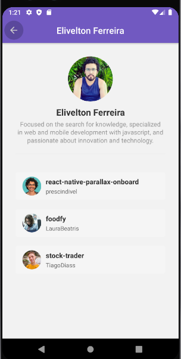

<h1 align="center">Github Overview</h1>

<h4 align="center">


<br/>

</h4>

<h3 align="center">
  This application was developed with React Native, consuming github API to load user information and their favorite repositories
</h3>

<p align="center">

  

  

   

  

</p>

<p align="center">
  <a href="#description">Description</a>&nbsp;&nbsp;&nbsp;|&nbsp;&nbsp;&nbsp;
  <a href="#technologies">Technologies</a>&nbsp;&nbsp;&nbsp;|&nbsp;&nbsp;&nbsp;
  <a href="#objective">Project's goal</a>&nbsp;&nbsp;&nbsp;|&nbsp;&nbsp;&nbsp;
  <a href="#prerequisites">Prerequisites</a>&nbsp;&nbsp;&nbsp;|&nbsp;&nbsp;&nbsp;
  <a href="#run">How to Run</a>&nbsp;&nbsp;&nbsp;|&nbsp;&nbsp;&nbsp;
  <a href="#result">Result</a>

<br />

<h2 id="description" name="description">
📝 Description
</h2>

<p>
This application was created according to the teachings of <a href="https://rocketseat.com.br/"> Rocketseat </a>, with a focus on mobile to put into practice the teachings about React Native and other dependencies , such as Axios for API consumption and React Navigation for transition between screens.
</p>

<br />

<h2 id="technologies" name="technologies">
🚀 Technologies
</h2>

- [React Native](https://reactnative.dev/)
- [React Navigation](https://reactnavigation.org/)
- [React Navigation/stack](https://reactnavigation.org/docs/stack-navigator/)
- [React Native Gesture Handler](https://github.com/software-mansion/react-native-gesture-handler)
- [Reactotron React Native](https://github.com/infinitered/reactotron)
- [React native vector icons](https://react-icons.github.io/react-icons/)
- [Styled Components](https://styled-components.com/)
- [Axios](https://github.com/axios/axios)
- [Eslint](https://eslint.org/)
- [Prettier](https://prettier.io/)

<br />

<h2 id="objective" name="objective">
🎯 Project's goal
</h2>
<p>
The satisfaction of completing a mobile project, with the purpose of learning, is very gratifying, as it helps to raise your creativity and willpower to face challenges and solve problems, in this application I develop following video lessons, but the biggest challenge was to convert parts of old methods for what the tools used in development currently support, involved a lot of research and a lot of attention, and I was happy with the result.
</p>

<br />

<h2 id="prerequisites" name="prerequisites">
⚠️  Prerequisites
</h2>

<p>
To use and test the app on a simulator or on your smartphone, you must have already set up the development environment for React Native apps.
<br/>
<br/>
You can follow the following article (PT-BR) to set up your environment:

<br />
<a href="https://react-native.rocketseat.dev/">
React Native Environment (Android/iOS)
</a>
</p>

<br />

<h2 id="run" name="run">
▶️ How to Run
</h2>

<p>
To clone and run this application, you will need <a href="https://git-scm.com/"> Git </a>, <a href="https://nodejs.org/en/"> Node.js </a> v12.18 or higher + <a href="https://yarnpkg.com/"> Yarn </a> v1.22 or higher installed on your computer.
<br />
<br />
<strong>On your command line:</strong>
</p>

```bash
# Clone the repository in some directory of your computer
$ git clone https://github.com/eliveltonsf/github-overview-mobile.git

# Enter in the repository
$ cd githubOverview

# Install the dependencies
$ yarn install

# Run the app (iOS)
$ yarn ios

# Run the app (Android)
$ yarn android
```

<br />

<h2 id="result" name="result">
✅ Result
</h2>

#### Main screen and favorite repository list screen

<h5 align="center">


</h5>
<br />

<hr>

Made with :purple_heart: By Elivelton Ferreira. [Get in touch!](https://www.linkedin.com/in/eliveltonsf/) :calling:
